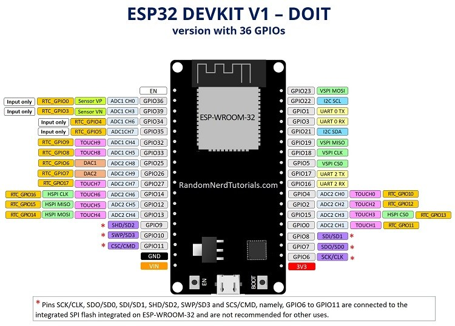

<p align="center">
  <a href="" rel="noopener">
 </a>
</p>

<h3 align="center">LoneTree Smart Dosing Device</h3>

<div align="center">

[]()

</div>

---

<p align="center"> LoneTree Smart Dosing Device
    <br> 
</p>

# 📝 Table of Contents

- [About](#about)
- [Smart Socket](#sfms)
  - [Getting Started](#getting_started)
  - [Circuit](#circuit)
  - [WebApp](#webapp)
  - [Usage](#usage)
  - [List Of Components](#list)
  - [Built Using](#built_using)
  - [Authors](#authors)


# 📜 About <a name = "about"></a>

This repo contains

- Backend
- Firmware
- Detailed instructions

<br><br>

#   Smart Dosing Device<a name = "sfms"></a>
## Getting Started <a name = "getting_started"></a>

These instructions will get you a copy of the project up and running on your system.

### Prerequisites

Things you need to install the FW.

```
- Arduino IDE
```

### Installing <a name = "installing"></a>

A step by step series that tell you how to get the Firmware and Backend running

#### ESP32 Configuration(Frequency Counter)

You should have Arduino IDE Installed

1.  Add ESP32 Board to your Arduino IDE
2.  In your Arduino IDE, go to File> Preferences
    Installing ESP32 Add-on in Arduino IDE Windows, Mac OS X, Linux open preferences
3.  Enter `https://dl.espressif.com/dl/package_esp32_index.json`
    into the “Additional Board Manager URLs” field then, click the “OK” button:
    Note: if you already have the ESP32 boards URL, you can separate the URLs with a comma(each board will go to neaw line) as follows:
    `https://dl.espressif.com/dl/package_esp32_index.json,\n http://arduino.esp8266.com/stable/package_esp8266com_index.json`

4.  Open the Boards Manager. Go to Tools > Board > Boards Manager…
5.  Search for ESP32 and press install button for the ESP32 by Espressif Systems“:
6.  That’s it. It should be installed after a few seconds.
7.  In your Arduino sketchbook directory, create tools directory if it doesn't exist yet.
8.  Unpack the tool into tools directory(present in libs/ESP32FS-1.0.zip) (the path will look like <home_dir>/Arduino/tools/ESP32FS/tool/esp32fs.jar).
9.  Close and re-open the Arduino IDE.

10. Now copy the contents of the libs folder to the libraries directory of your Arduino
    1. If you are using windows, the libraries directory will be Documents/Arduino/libraries

##### ESP32 Node FW Uploading

1.  Select ESP32 Dev Module from Tools->Board->ESP32
2.  Select the correct port from Tools->Port
3.  Then open ESP32_FW.ino file from Firmware/ESP32_FW folder.
4.  Select Tools > ESP32 Sketch Data Upload menu item. This should start uploading the files into ESP32 flash file system.
5.  Now Upload the Code to your ESP32 Dev Module.
6.  Your ESP32 is now ready to be used.

#### Arduino Nano Configuration

1.  Open ArduinoNano_FW.ino file from Firmware/ArduinoNano_FW folder.
2.  Select Arduino Nano from Tools->Board
3.  Select the correct port from Tools->Port
4.  Now Upload the Code to your Arduino Nano.

If the code uploaded succesfully, you can disconnect the USB Cable from Arduino Nano.
##  🔌Circuit <a name = "circuit"></a>

### ESP32 DevKit V1 Pinout

Follow the pinout diagram given below to connect different components to your ESP32 DevKit V1 board.




### Complete Circuit Diagram

Here's the complete circuit diagram of the system.


### Other Components

```http
Other components pin connection details
```

#### Smart Dosing Device

```Different Components connected to Arduino Nano for Frequency Measurements```

#### ESP32 With Arduino Nano Connections

```Arduino Nano Connected with ESP32```

| Arduino Nano | ESP32 |
| :---------- | :---- |
| `D5`   | `TX2` |
| `D6`   | `RX2` |
| `GND`   | `GND` |

#### TDS Sensor

```Arduino Nano Connected with TDS Sensor```

| TDS Sensor | Arduino Nano |
| :---------- | :---- |
| `S`   | `A0` |
| `VCC`   | `VIN` |
| `GND`   | `GND` |

#### pH Sensor

```Arduino Nano Connected with pH Sensor```

| pH Sensor | Arduino Nano |
| :---------- | :---- |
| `S`   | `A1` |
| `VCC`   | `VIN` |
| `GND`   | `GND` |

#### ORP Sensor

```Arduino Nano Connected with ORP Sensor```

| ORP Sensor | Arduino Nano |
| :---------- | :---- |
| `A`   | `A2` |
| `+`   | `VIN` |
| `-`   | `GND` |

#### CO2 Sensor

```Arduino Nano Connected with CO2 Sensor(MQ-135)```

| CO2 Sensor | Arduino Nano |
| :---------- | :---- |
| `A0`   | `A3` |
| `VCC`   | `VIN` |
| `GND`   | `GND` |

#### DS18B20 Sensor

```Arduino Nano Connected with DS18B20 Sensor```

| DS18B20 Sensor | Arduino Nano |
| :---------- | :---- |
| `A`   | `D12` |
| `+`   | `VIN` |
| `-`   | `GND` |

#### Temperature and Humidity Sensor

```DHT22 Connected with ESP32```

| DHT22 Pins | ESP32     |
| :--------- | :---- |
| `VCC`      | `5V`  |
| `GND`      | `GND` |
| `Data`     | `D12` |

#### 8 Channle Relay Module(SSR or Mechanical)

```Relay Connected with ESP32 via Logic Level Shifter```

| Relay Module Pins | ESP32 |
| :---------------- | :---- |
| `VCC`             | `5V`  |
| `IN1`             | `D32` |
| `IN2`             | `D19` |
| `IN3`             | `D18` |
| `IN4`             | `D5`  |
| `IN5`             | `D4`  |
| `IN6`             | `D2`  |
| `IN7`             | `D15` |
| `IN8`             | `D26` |
| `GND`             | `GND` |

#### OLED Display

```OLED Connected with ESP32```

| OLED Pins | ESP32 |
| :--------- | :---- |
| `VCC`      | `3.3`  |
| `GND`      | `GND` |
| `SCL`     | `D22` |
| `SCL`     | `D21` |


## 💻WebApp <a name = "webapp"></a>


WebApp can be accessed from the link below

-   URL: https://lonetree-webapp.production.rehanshakir.com/

    -   Username: admin@lontree.com

    -   Password: 12345678

### Data
Data published from the device would be in the JSON format given below:

```json
{
  "macAddress": "",
  "temperature": "",
  "humidity": "",
  "liquidtemperature": "",
  "tds": "",
  "ph": "",
  "orp": "",
  "co2": "",
}
```

### MQTT Topics

```MQTT Topic Details```
*   As seen from ESP32

| Topic | Type | Details
| :---------- | :---- |  :---- |
| `smartdosing/`   | `PUBLISH` |  `Publishes the Sensors' payload JSON` | 
| `macAddress/dosingControl`   | `SUBSCRIBE` |  `Control Pumps. Payload PumpNumber,PumpState. Where PumpNumber=1-8 and PumpState=0 or 1` | 

### FrontEnd

-   The WebApp is developed using NodeJS, ReactJS and MongoDB.

 Sign-up/Sign-in Page
 Dashboard Home Page
### Database

You can access the database from the link below

**TO BE ADDED**
<!-- 
*   http://LoneTree Smart Dosing Device-data-preview.production.rehanshakir.com/
    *   User: admin
    *   Password: admin

 Database -->

## Usage <a name = "usage"></a>

1.  [Upload the code to your Arduino Pro Mini](https://github.com/Nauman3S/LoneTree Smart Dosing Device#arduino-pro-mini-configuration)
2.  [Upload the code to your ESP32](https://github.com/Nauman3S/LoneTree Smart Dosing Device#esp32-configurationfrequency-counter)
3.  [Make the circuit](https://github.com/Nauman3S/LoneTree Smart Dosing Device#complete-circuit-diagram)
4.  Power on your ESP32, it will present you with an AP named `SmartDosing-abcd` (while `SmartDosing` can be changed in the portal and `abcd` is a unique id for each esp32) 
5.  Default captive portal password `123456789AP` which can be changed in captive portal. 
6.  Connect to the ESP32 access point and open the web-browser and navigate to the link `http://esp32.local/_ac`. This link will work on most of the operating systems but if your operating system is not allowing to open it, you may want to check the captive portal IP Address from the serial monitor and can use that IP address inplace of the above mentioned URL. 
7.  The default access IP Address is `http://192.168.4.1/_ac` 
8.  You will be presented with a main dashboard as shown below(based on your device)

    * You can also open `http://esp32.local/` to access the CaptivePortal.

9. You can connect to WiFi, from "Connect to WiFi" menu

10. Once connected to a WiFi network, you can again access the captive portal using same URL or the IP Address from the Serial monitor.
11. You can open settings page with following default credentials
   1.  User: **AP Name (SmartDosing)**
   2.  Password: **admin**

In settings page, you can configure your device. You can set network type (WiFi/GPRS) and you can set network APN details as well.


13. Open the [test dashboard](https://nodered-proxy.production.wrapdrive.tech/ui/#!/2) to see the live data

<br><br>

### PCB

**TO BE ADDED**
<!-- 
 -->


### Casing


<br><br>
# List of Components <a name = "list"></a>

Following components are used to make this project

1.   Microcontrollers
     *   [ESP32 Dev Module](https://www.amazon.com/VKLSVAN-ESP-WROOM-32-Development-Dual-Mode-Microcontroller/dp/B07T6J3PXZ/ref=sr_1_5?keywords=esp32+devkit&qid=1652733191&sprefix=esp32+dev%2Caps%2C165&sr=8-5)
     *   [Arduino Nano](https://www.amazon.com/Deegoo-ATmega328P-Microcontroller-Board-Arduino/dp/B07R9VWD39/ref=sr_1_6?crid=2179CL53V5MWC&keywords=arduino+nano&qid=1652733134&sprefix=arduino+nano%2Caps%2C168&sr=8-6)

2.  Sensors
    *   [TDS Sensor](https://www.amazon.com/CQRobot-Ocean-Compatible-Scientific-Laboratory/dp/B08KXRHK7H/ref=sr_1_8?crid=1APGH1PW0VQVO&keywords=gravity+orp+sensor&qid=1652732820&sprefix=gravity+orp+senso%2Caps%2C171&sr=8-8)
    *   [pH Sensor](https://www.amazon.com/Accuracy-Connect-Terminal-Electrode-Detection/dp/B08GYF269Y/ref=sr_1_1_sspa?crid=2CAFO2BY60GSI&keywords=gravity+ph+sensor&qid=1652732873&sprefix=gravity+ph%2Caps%2C139&sr=8-1-spons&psc=1&smid=A1YU5GT3B4HWHJ&spLa=ZW5jcnlwdGVkUXVhbGlmaWVyPUFZNk9UUFlDNkZaNUkmZW5jcnlwdGVkSWQ9QTA0NTQyMjYyNVdaUUU3RVY5VkcyJmVuY3J5cHRlZEFkSWQ9QTAwMzU4MjcyUE1OUDI0Vk9LQUlIJndpZGdldE5hbWU9c3BfYXRmJmFjdGlvbj1jbGlja1JlZGlyZWN0JmRvTm90TG9nQ2xpY2s9dHJ1ZQ==)
    *   [ORP Sensor](https://www.dfrobot.com/product-1071.html)
    *   [CO2 Sensor](https://www.amazon.com/MQ-135-Quality-Hazardous-Detection-Arduino/dp/B07ZZ61LQT/ref=sr_1_4?crid=2MRE4482B1Y6&keywords=mq+135&qid=1653812430&sprefix=mq+13%2Caps%2C158&sr=8-4)
    *   [DS18B20 Temperature Sensor Probe](https://www.amazon.com/DS18B20-Temperature-Waterproof-Stainless-Raspberry/dp/B094FKQ9BS/ref=sr_1_22_sspa?crid=3BI0JPGUYS27U&keywords=ds3231+probe&qid=1652732757&sprefix=ds3231+prob%2Caps%2C155&sr=8-22-spons&psc=1&spLa=ZW5jcnlwdGVkUXVhbGlmaWVyPUEyN1NQTjVWUlpYNEhVJmVuY3J5cHRlZElkPUEwNzIwNTc1MUNYWktRUk9WRVlPTyZlbmNyeXB0ZWRBZElkPUEwNjYzNzY1MjZSOURHU0VHSVI3SCZ3aWRnZXROYW1lPXNwX2J0ZiZhY3Rpb249Y2xpY2tSZWRpcmVjdCZkb05vdExvZ0NsaWNrPXRydWU=)
    *   [Humidity and Temperature Sensor](https://www.amazon.com/ICQUANZX-Digital-Temperature-Humidity-Monitor/dp/B08XQNKW4P/ref=sr_1_3?crid=36YP22XYCJS7O&keywords=dht22&qid=1652732914&sprefix=dht2%2Caps%2C163&sr=8-3)

3.  Display
    * [OLED](https://www.amazon.com/UCTRONICS-SSD1306-Self-Luminous-Display-Raspberry/dp/B072Q2X2LL/ref=sr_1_7?keywords=oled+0.96&qid=1652733097&sprefix=oled+0.%2Caps%2C159&sr=8-7)
4.  Power
    *   [5v 5A DC Adapter](https://www.amazon.com/ALITOVE-Converter-5-5x2-1mm-100V-240V-Security/dp/B078RT3ZPS/ref=sr_1_3?keywords=5v%2B5a%2Bpower%2Bsupply&qid=1652733461&sprefix=5v%2B5a%2Caps%2C164&sr=8-3&th=1)
5.  Misc
    *   [8 Channel Relay Module for Pumps](https://www.amazon.com/SainSmart-101-70-102-8-Channel-Relay-Module/dp/B0057OC5WK/ref=sr_1_3?crid=QF6Z4XF4V0GG&keywords=8+channel+relay&qid=1652733309&sprefix=8%2Caps%2C145&sr=8-3)

    *   [Bi-directional logic level shifter](https://www.amazon.com/SongHe-Channels-Converter-Bi-Directional-Shifter/dp/B07YZTW2SM/ref=sr_1_4?keywords=bidirectional+logic+level+converter+3.3v+to+5v&qid=1652733423&sprefix=bi+directional+log%2Caps%2C169&sr=8-4)
# ⛏️ Built Using <a name = "built_using"></a>


- [Arduino](https://www.arduino.cc/) - Embedded Framework and IDE - For Sensor Node Design


# ✍️ Authors <a name = "authors"></a>

- [@Nauman3S](https://github.com/Nauman3S) - Development and Deployment
